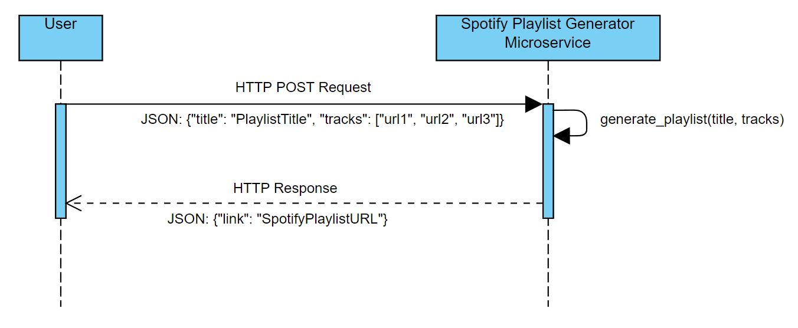

# Spotify Playlist Creator Microservice

Note that the user **must connect to OSU VPN** in order to navigate to the URL to use the microservice.

### How To Request Data
As stated above, make sure you are connected to the VPN.

In order to create a playlist the user must send a POST request to the following URL:
[http://flip3.engr.oregonstate.edu:23401/playlistgenerator](http://flip1.engr.oregonstate.edu:23401/playlistgenerator).

The POST request must submit JSON data. So, it must have its mimetype set to be application/json. The JSON object that
is submitted must be formatted as follows:

```
{
    "title": "Insert Playlist Title Here",
    "tracks": [
        "Spotify URL to song 1",
        "Spotify URL to song 2",
        "Spotify URL to song 3"
    ]
}
```

You can submit any many track URLs as you like, there is no limit. Here is some example code
for submitting a POST request using Python's `requests` package:

```
import requests

request = requests.post('http://flip1.engr.oregonstate.edu:3138/playlistgenerator', json={
    'title': "My playlist", 
    'tracks': [
        "https://open.spotify.com/track/2NtqZmfRIDkXJ2YvY2Kv1F?si=c286783f05554217",
        "https://open.spotify.com/track/4lFO4X6ef61SR6M1KXkSRN?si=55590f077b4a410e",
        "https://open.spotify.com/track/4pCNJwixy2ImFncaPY2yE2?si=7b57e427de78428c"
        ]
    })
```

### How To Receive Data
Once the playlist is created the service sends a Response object to the user that is a JSON object,
thus its mimtype is application/json. The format of the returned JSON is as follows:

```
{
    "link": "URL To The Created Spotify Playlist"
}
```

If you were to use the `requests` package in Python to make your request, you can access the JSON object in
the response as follows:

```
import requests

## Make a request at the link with a valid JSON object
response = requests.post('http://flip1.engr.oregonstate.edu:3138/playlistgenerator', json={
    'title': "My playlist", 
    'tracks': [
        "https://open.spotify.com/track/2NtqZmfRIDkXJ2YvY2Kv1F?si=c286783f05554217",
        "https://open.spotify.com/track/4lFO4X6ef61SR6M1KXkSRN?si=55590f077b4a410e",
        "https://open.spotify.com/track/4pCNJwixy2ImFncaPY2yE2?si=7b57e427de78428c"
        ]
    })

## Get JSON response
json_response = response.json()

## Get the url
url = json_response['link']
```

### Microservice UML Sequence Diagram




### Instructions for self-hosting
In order to self-host in case of emergencies, clone this repo and install the latest version of python.
Once python is installed create a python environment for the microservice that has the following packages installed:
```
flask
spotipy
python-dotenv
```
In the root directory create a .env file with the following variables:
```
MY_CLIENT_ID = "YOUR_CLIENT_ID_GOES_HERE
MY_CLIENT_SECRET = "YOUR_CLIENT_SECRET_GOES_HERE"
MY_USER_NAME = "YOUR_USER_NAME_GOES_HERE"
```
where the client id and secret id are obtained from the spotify developer portal (create a new app if needed).
In the associated app in the developer portal be sure to add the associated redirect URI that you specify in
your helper function. From there change all instances of the flip URL to localhost along with the desired port numbers.
Once all of that is done activate your python environment you've created, navigate to the project root directory
and run the following command:
```
py app.py
```
Then you should be good to go!
